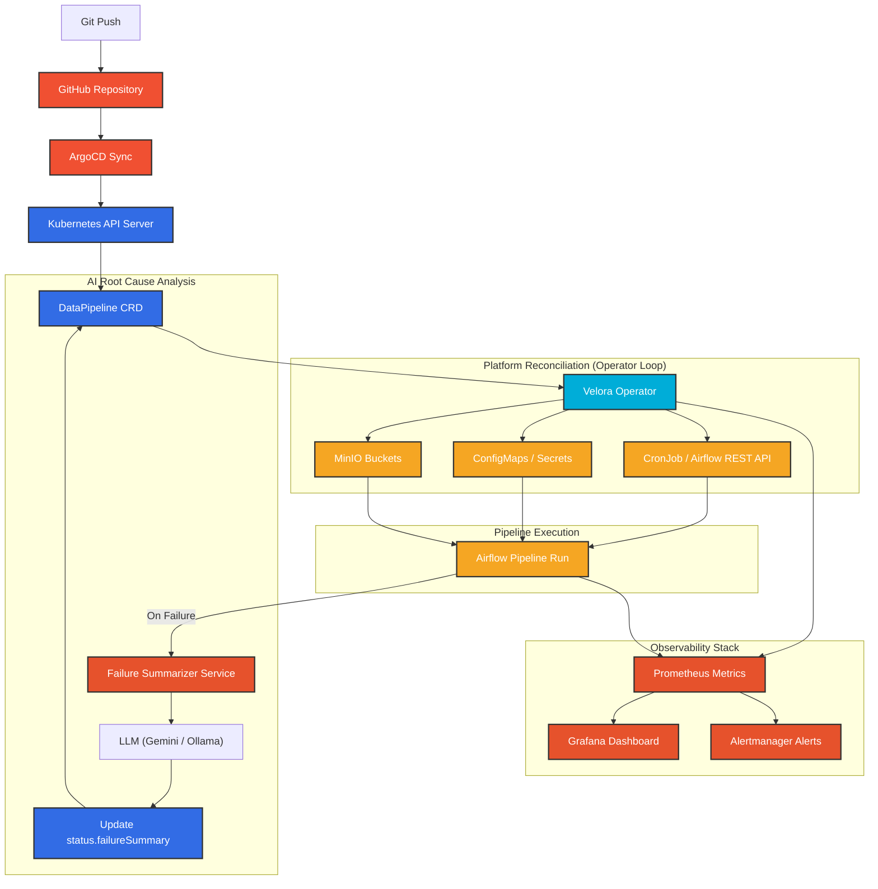

# Velora — GitOps Data Platform

Declarative data pipeline provisioning and reconciliation on Kubernetes.

## Developer Experience

**Before Velora**
1. Create and test an Apache Airflow DAG in Python.
2. Manually provision target storage buckets (e.g. S3, GCS, MinIO).
3. Securely share connection secrets (e.g., PostgreSQL credentials) to the DAG.
4. Manually configure retry parameters, schedules, and timeouts.
5. Set up dashboard metrics, alerts, and SLOs.
6. Deploy the DAG to shared volume / Git repository.
7. Verify all components are wired correctly.

**After Velora**
```bash
kubectl apply -f pipeline.yaml
```

Applying this single file handles bucket provisioning, configuration propagation, scheduling, and monitoring automatically.

---

## Tech Stack
- **Cluster**: `kind` (Kubernetes in Docker) for local development, `GKE` for cloud.
- **IaC**: Terraform to provision local `kind` and cloud-optional infrastructure.
- **GitOps**: ArgoCD to manage Git-to-cluster synchronization.
- **Operator**: Custom Go operator built with `kubebuilder` (v4).
- **Orchestration**: Apache Airflow driven programmatically via REST API (KubernetesExecutor).
- **Storage**: MinIO (S3-compatible, self-hosted) for pipeline outputs.
- **Observability**: Prometheus + Grafana stack with custom metrics.

---

## Architecture



---


## Setup & Bootstrap (Phase 1)

Ensure you have completed the [WSL2 Ubuntu Prerequisite Setup](docs/implementation_plan.md) (Docker, Go 1.22+, Terraform, Helm, kubectl, kind, and kubebuilder installed inside WSL2).

### 1. Initialize & Start the Platform
Run the bootstrap script inside your WSL2 environment:
```bash
chmod +x scripts/bootstrap.sh
./scripts/bootstrap.sh
```

### 2. Access Dashboards
To forward all platform services, run:
```bash
./scripts/port-forward.sh all
```

Access URLs:
- **ArgoCD**: [http://localhost:8080](http://localhost:8080) (admin / auto-generated password)
- **Airflow**: [http://localhost:8081](http://localhost:8081)
- **MinIO**: [http://localhost:9001](http://localhost:9001) (velora / velora-minio-secret)
- **Grafana**: [http://localhost:3000](http://localhost:3000)
