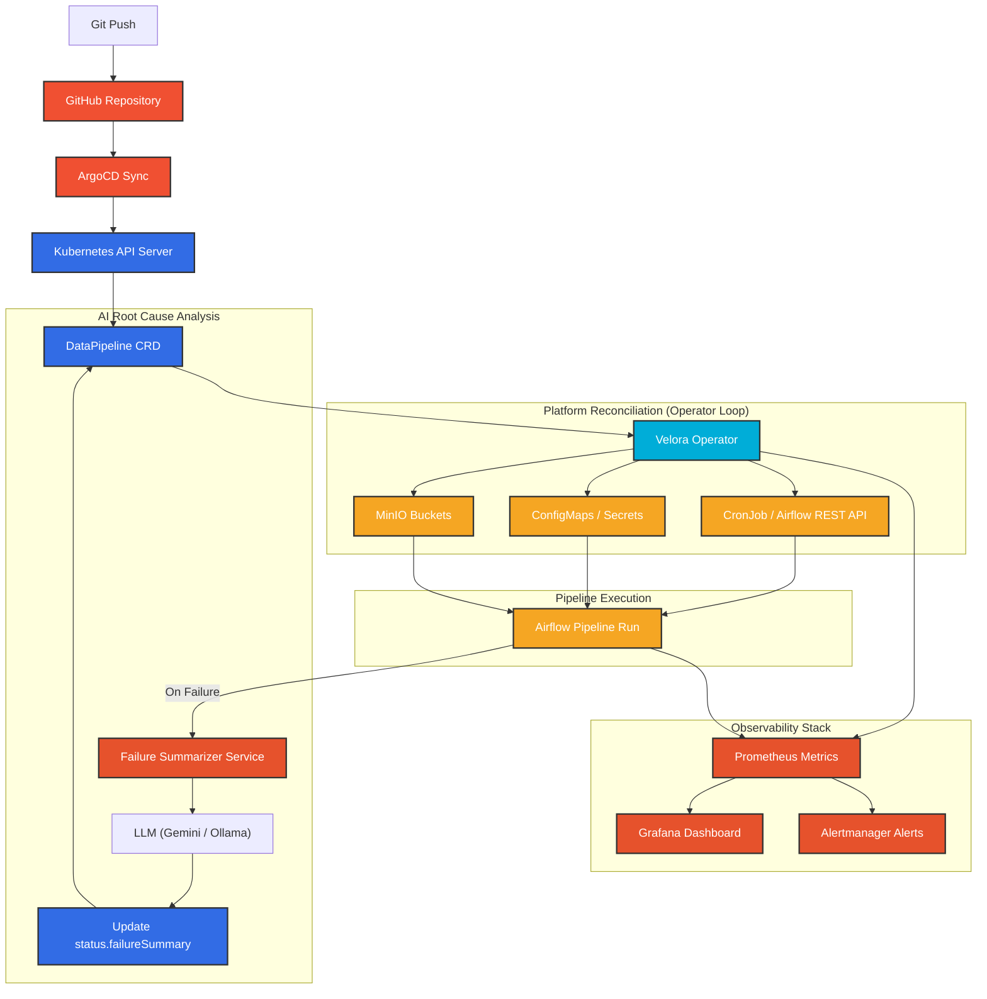

# Velora — GitOps Data Platform

Declarative data pipeline provisioning and reconciliation on Kubernetes.

## Developer Experience

**Before Velora**
1. Create and test an Apache Airflow DAG in Python.
2. Manually provision target storage buckets (e.g. S3, GCS, MinIO).
3. Securely share connection secrets (e.g., PostgreSQL credentials) to the DAG.
4. Manually configure retry parameters, schedules, and timeouts.
5. Set up dashboard metrics, alerts, and SLOs.
6. Deploy the DAG to shared volume / Git repository.
7. Verify all components are wired correctly.

**After Velora**
```bash
kubectl apply -f pipeline.yaml
```

Applying this single file handles bucket provisioning, configuration propagation, scheduling, and monitoring automatically.

---

## Tech Stack
- **Cluster**: `kind` (Kubernetes in Docker) for local development, `GKE` for cloud.
- **IaC**: Terraform to provision local `kind` and cloud-optional infrastructure.
- **GitOps**: ArgoCD to manage Git-to-cluster synchronization.
- **Operator**: Custom Go operator built with `kubebuilder` (v4).
- **Orchestration**: Apache Airflow driven programmatically via REST API (KubernetesExecutor).
- **Storage**: MinIO (S3-compatible, self-hosted) for pipeline outputs.
- **Observability**: Prometheus + Grafana stack with custom metrics.

---

## Architecture



---


## Environment Setup

> [!IMPORTANT]
> **Execution Environment — WSL2 Ubuntu Required:**
> Velora's infrastructure scripts, Kubernetes tooling, Makefiles, and port-forwarding daemons require a Linux POSIX environment.
> On Windows machines, **ALL commands and scripts MUST be executed inside WSL2 Ubuntu**, never in Windows PowerShell or CMD.

### Prerequisites

Install the following tools **inside WSL2 Ubuntu** (not Windows):

| Tool | Min Version | Install Guide |
|------|-------------|---------------|
| **Docker Desktop** | 24.x | [docs.docker.com](https://docs.docker.com/desktop/install/windows-install/) — enable WSL2 backend |
| **Go** | 1.22+ | `sudo snap install go --classic` or [go.dev/dl](https://go.dev/dl/) |
| **Terraform** | 1.6+ | `sudo snap install terraform --classic` |
| **Helm** | 3.x | `sudo snap install helm --classic` |
| **kubectl** | 1.30+ | `sudo snap install kubectl --classic` |
| **kind** | 0.23+ | `go install sigs.k8s.io/kind@latest` |
| **kubebuilder** | 4.x | `go install sigs.k8s.io/kubebuilder/cmd@latest` |

### Configure Your Shell

Add these to your `~/.bashrc` (or `~/.zshrc`) so kubectl and Go binaries are always found:

```bash
# Velora environment
export PATH=$PATH:/usr/local/go/bin:$HOME/go/bin:/snap/bin
export KUBECONFIG=$HOME/.kube/velora-config
```

Then reload:
```bash
source ~/.bashrc
```

### Verify Your Environment

```bash
# Navigate to the project
cd /mnt/c/Projects/velora

# Verify all tools are available
docker info          # Docker daemon is running
kind version         # kind CLI
kubectl version --client  # kubectl CLI
helm version         # Helm CLI
terraform version    # Terraform CLI
go version           # Go compiler
```

---

## Setup & Bootstrap (Phase 1)

### 1. Initialize & Start the Platform

Run the bootstrap script inside your **WSL2** environment:
```bash
cd /mnt/c/Projects/velora
chmod +x scripts/*.sh
./scripts/bootstrap.sh
```

The bootstrap script will:
1. Provision a `kind` cluster via Terraform
2. Pre-load ArgoCD container images (prevents network timeout failures)
3. Install ArgoCD via Helm (with automatic retry on failure)
4. Register the GitHub repo and apply the App-of-Apps
5. Print access credentials

### 2. Access Dashboards (Port Forwarding)

Run the port-forward script in a **dedicated WSL2 terminal window/tab**:
```bash
cd /mnt/c/Projects/velora
./scripts/port-forward.sh all
```

Once running, access services from your Windows browser:

| Service | URL | Credentials |
|---------|-----|-------------|
| **ArgoCD** | [http://localhost:30080](http://localhost:30080) | `admin` / see below |
| **Airflow** | [http://localhost:30081](http://localhost:30081) | default |
| **MinIO Console** | [http://localhost:30090](http://localhost:30090) | `velora` / `velora-minio-secret` |
| **Grafana** | [http://localhost:30300](http://localhost:30300) | default |

**Get ArgoCD admin password:**
```bash
kubectl -n argocd get secret argocd-initial-admin-secret -o jsonpath="{.data.password}" | base64 -d; echo
```

### 3. Build & Deploy the Operator (Phase 2)

The Velora Operator is custom-built and not pushed to a public registry. Build and load it into kind:

```bash
cd /mnt/c/Projects/velora/operator
make docker-build
kind load docker-image ghcr.io/yashasbn/velora-operator:latest --name velora
```

Once loaded, ArgoCD will automatically detect the image and start the `velora-operator` deployment.

---

## Cluster Recovery

If you see `connection refused` errors from `kubectl`:
```
dial tcp 127.0.0.1:XXXXX: connect: connection refused
```

This means the kind cluster is not running. Common causes:
- Docker Desktop was restarted
- WSL2 was rebooted
- The cluster was accidentally deleted

**To fix:**

```bash
# 1. Make sure Docker is running
docker info

# 2. Check if the kind cluster still exists
kind get clusters

# 3a. If "velora" is listed — the cluster exists but may need a restart:
#     Docker restart usually recovers it. Just wait ~30s after Docker starts.
docker restart velora-control-plane 2>/dev/null || true
docker restart velora-worker 2>/dev/null || true
docker restart velora-worker2 2>/dev/null || true
sleep 10
kubectl cluster-info

# 3b. If "velora" is NOT listed — re-bootstrap from scratch:
cd /mnt/c/Projects/velora
./scripts/bootstrap.sh
```

---

## Teardown

To stop everything and return to a clean state:

```bash
# Delete the kind cluster (all pods, nodes, namespaces)
kind delete cluster --name velora

# Remove kubeconfig
rm -f ~/.kube/velora-config

# Clean up Terraform state
cd /mnt/c/Projects/velora/infra/terraform
rm -f terraform.tfstate terraform.tfstate.backup .terraform.lock.hcl
```

---

## Troubleshooting

Hit an error? See **[docs/troubleshooting.md](docs/troubleshooting.md)** for known issues and fixes:

| Error | Cause | Fix |
|-------|-------|-----|
| `env: $'bash\r': No such file or directory` | CRLF line endings | Fixed via `.gitattributes`. Re-clone or run `dos2unix` on scripts |
| `chmod` not recognized | Running in PowerShell | Switch to WSL2 Ubuntu |
| `kind` / `helm` not found | Missing from PATH | Add `/snap/bin` and `$HOME/go/bin` to PATH |
| `connection refused` on kubectl | Cluster not running | See **Cluster Recovery** above |
| `timed out waiting for the condition` | Image pull timeout | Bootstrap now pre-loads images; re-run `./scripts/bootstrap.sh` |
| Docker permission denied | User not in docker group | `sudo usermod -aG docker $USER` then re-login |
| ArgoCD SSL certificate error | Repo secret misconfigured | Check `gitops/argocd/install/repo-secret.yaml` has `insecure: "true"` |
| Wrong WSL distro (`docker-desktop`) | Default WSL not Ubuntu | `wsl --set-default Ubuntu` |

---

## License

This project is licensed under the **GNU General Public License v3.0 (GPLv3)** — see the [LICENSE](LICENSE) file for details.
