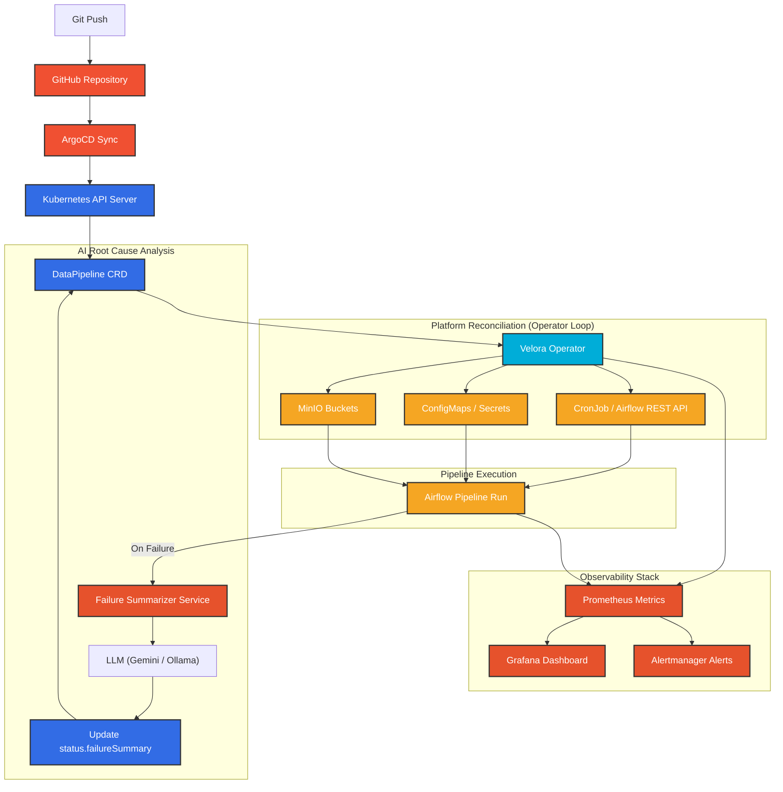

# Velora — Architecture & Design Decisions

This document outlines the architectural blueprints, components, workflows, and core design decisions of the Velora GitOps Data Platform.

---

## Architecture Diagram

---

## Core Components

1. **GitHub & ArgoCD (GitOps Engine)**:
   The declarative configuration (the `DataPipeline` Custom Resource) resides in a Git repository. ArgoCD continuously monitors Git and applies the configuration state to the cluster.
2. **Velora Custom Operator**:
   A Kubernetes controller built using Go and the `kubebuilder` framework. It reconciles the state of `DataPipeline` resources by ensuring dependencies (like MinIO buckets) are provisioned, and launching the required cron schedules.
3. **Apache Airflow**:
   The workflow engine that coordinates source-to-destination pipelines. It uses the `KubernetesExecutor` to isolate executions.
4. **MinIO (S3-Compatible Storage)**:
   Acts as the data warehouse destination where transformed data is parked.
5. **Observability Stack**:
   Prometheus scrapes custom metrics exported by the operator's reconcile loop, while Grafana visualizes the operational health.
6. **AI Failure Summarizer**:
   An independent controller that watches for failed pipeline states, grabs target logs from Airflow, and annotates the `DataPipeline` status with plain-English diagnostics.

---

## Architecture Design Decisions & Tradeoffs

### 1. Programmatic Airflow Triggering vs. Shared Volume DAG Files
*   **The Anti-pattern**: In standard deployments, developers mount a shared filesystem (like NFS, EFS, or Git-Sync sidecars) to sync Python DAG files into Airflow's DAG folder. This introduces volume locking issues, replication delays, and execution drifts.
*   **Velora's Design**: Velora exposes a single wrapper DAG that acts as an execution shell. The operator reconciles pipeline-specific configurations as ConfigMaps. The scheduled CronJob invokes Airflow's REST API to trigger a DAG run containing the runtime ConfigMap context.
*   **Tradeoff**: This requires the operator/CronJob to authenticate with Airflow, but significantly improves operational decoupling and scaling.

### 2. Decoupled AI Failure Summarizer
*   **The Design**: The AI service runs as a completely separate pod and reconcile loop.
*   **Rationale**: The operator's reconcile loop must be fast, lightweight, and deterministic. Blocking reconciliation to invoke a third-party LLM (like Gemini or Ollama) violates Kubernetes controller design principles and could lead to reconcile time-outs.
*   **Tradeoff**: Requires running a second process in the cluster, but isolates dependencies cleanly.

### 3. Status Subresource with Conditions
*   **The Design**: Utilizes `metav1.Condition` objects (`Ready`, `BucketCreated`, `DAGSynced`) within the status block.
*   **Rationale**: Exposing fine-grained conditions allows automated scripts and operators to act on transition phases cleanly, instead of relying on a single, coarse `phase` string.

### 4. Kubernetes-Native Finalizer Flow
*   **The Design**: When a `DataPipeline` is deleted, the operator blocks garbage collection using a finalizer until the managed CronJob and ConfigMaps are successfully removed. MinIO buckets are preserved by default to prevent catastrophic data loss.
